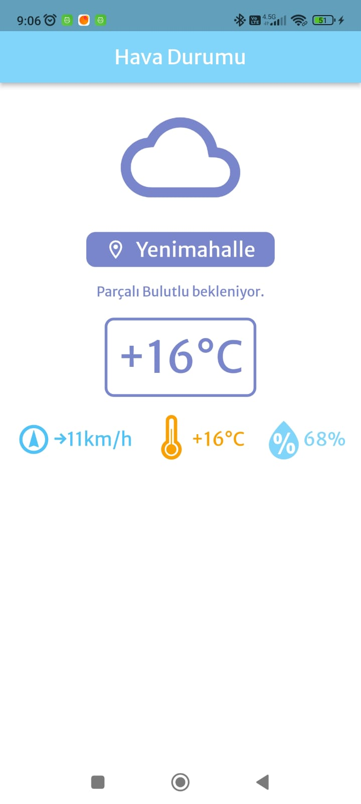

# Konum ile Hava Durumu

Bu Flutter projesi, kullanıcının konum bilgisini alarak https://wttr.in sitesinden hava durumu bilgilerini getirir.

## Özellikler

- Konum servisi kullanarak kullanıcının anlık konumunu ile bazında alır.
- Alınan konuma göre https://wttr.in sitesinden hava durumu bilgilerini çeker.
- Hava durumu bilgilerini kullanıcı dostu bir arayüzde gösterir.

## Kullanım

- Uygulama açıldığında konum izni istenebilir. İzin verildiğinde veya konum servisi etkinleştirildiğinde işlem devam eder.
- Konum bilgisi alındıktan sonra, https://wttr.in sitesinden hava durumu bilgileri çekilir ve kullanıcıya gösterilir.

## Gereksinimler

- HTTP
- Material Design Icons Flutter
- Google Fonts
- Weather Icons
- Geolocator
- Geocoding

## Kurulum

1. Bu uygulama Flutter için hazırlanmıştır.
2. Bu projeyi klonlayın veya indirin.
3. 'pubspec.yaml' dosyasında yer alan kütüphaneleri kullanın.
4. Kütüphanelerden güncel olmayanları uygun şekilde güncelleyebilirsiniz.

## Ekran Görüntüleri

## Lisans

Bu projenin lisansı falan yoktur. Dilediğiniz gibi kullanabilirsiniz. Eksik, hata, soru veya önerileriniz için bana ulaşabilirsiniz.

---

Geliştirici: Mustafa Arslan
E-posta: mustafaarslan.92@gmail.com

---------------------------------------------------

# Weather With Location

This Flutter project retrieves weather information from the https://wttr.in website based on the user's location.

## Features

- Retrieves the user's current location using the location service.
- Fetches weather information from the https://wttr.in website based on the obtained location.
- Displays weather information in a user-friendly interface.

## Usage

- The app may request location permission when opened. The process continues when permission is granted or when the location service is enabled.
- After obtaining the location information, the app retrieves weather information from the https://wttr.in website and displays it to the user.

## Requirements

- HTTP
- Material Design Icons Flutter
- Google Fonts
- Weather Icons
- Geolocator
- Geocoding

## Installation

1. This application is developed for Flutter.
2. Clone or download this project.
3. Use the libraries listed in the 'pubspec.yaml' file.
4. You can update the libraries to their appropriate versions if needed.

## Screenshots

## License

This project has no license. You can use it however you want. Feel free to reach out to me for any issues, errors, questions, or suggestions.

---

Developer: Mustafa Arslan
E-mail: mustafaarslan.92@gmail.com

